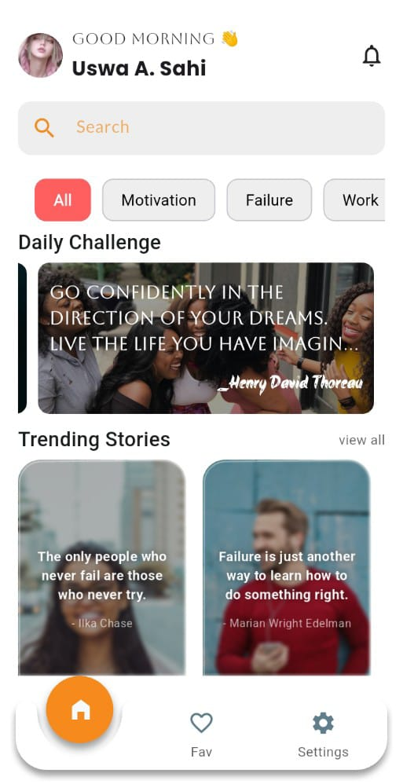
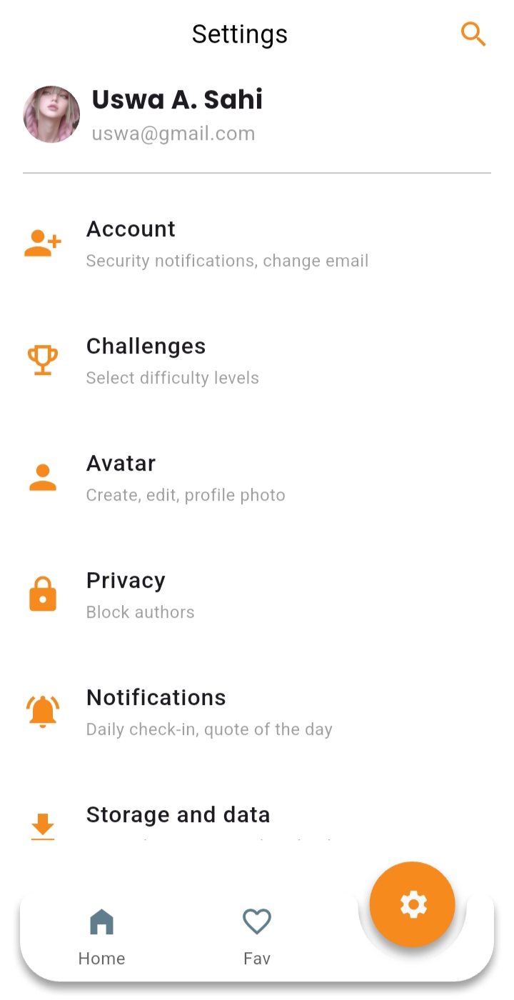

# A Daily Quote App (Flutter)

## UI Screenshots

Get a quick look at the main screens designed for the application.

| Home Screen | Favorite Screen | Settings Screen |
| :---: | :---: | :---: | :---: | :---: |
|  |  |  |

---

## 🙏 Acknowledgment

*A big thank you to Sir Ishaq Hassan for the invaluable mentorship and guidance* throughout the development and learning of Flutter concepts, which made the creation of this helpful, architecturally sound application possible.

---

A Daily Quote application built using *Flutter*.  
This project focuses on clean architecture, modern state management, and a smooth user experience with efficient local data handling.

## Features

- Browse trending, popular, and upcoming content  
- Detailed view with ratings and descriptions  
- Smooth animations and responsive UI components  
- Efficient image loading and caching  
- Offline support using local storage  
- Clean, scalable MVVM-based architecture 

---

## Tech Stack

- *Flutter*
- *Dart*
- *MVVM Architecture*
- *GetX* (State Management & Navigation)
- *HTTP* (API Networking)

---

## Packages Used

| Package | Version | Purpose |
|-------|--------|--------|
| get | ^4.7.3 | State management, navigation, and dependency injection |
| google_fonts | ^7.0.1 | Apply consistent and customizable typography |
| http | ^1.6.0 | Perform REST API and network requests |
| sensors_plus | ^7.0.0 | Access device motion and environmental sensors |
| path_provider | ^2.1.5 | Retrieve platform-specific file system paths |
| share_plus | ^12.0.1 | Enable native content sharing across platforms |
| loading_animation_widget | ^1.3.0 | Display reusable loading animations for improved UX |
| animated_notch_bottom_bar | ^1.0.4 | Animated bottom navigation bar with notch support |

---

A few resources to get you started if this is your first Flutter project:

- [YouTube: Sir Ishaq Hassan](https://www.youtube.com/@IshaqueHassan)
- [Lab: Write your first Flutter app](https://docs.flutter.dev/get-started/codelab)
- [Cookbook: Useful Flutter samples](https://docs.flutter.dev/cookbook)

For help getting started with Flutter development, view the
[online documentation](https://docs.flutter.dev/), which offers tutorials,
samples, guidance on mobile development, and a full API reference.